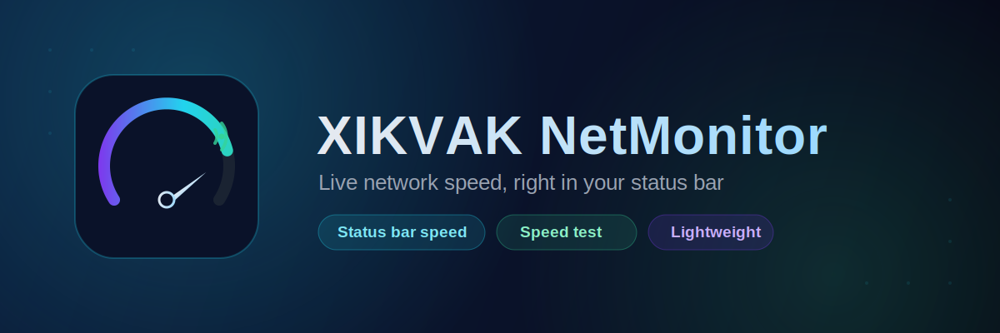
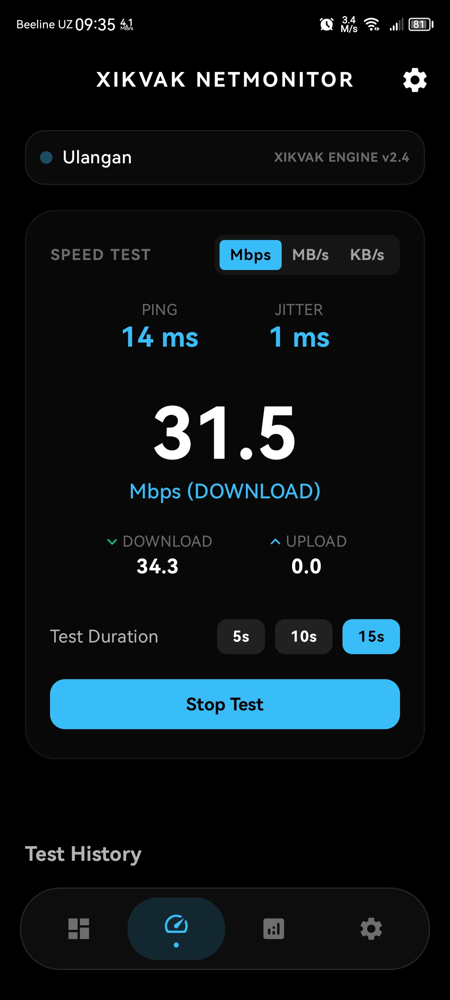

[-blue)](#)

**Your real-time internet speed, always visible in the status bar.**

[Download APK](../../releases/latest) · [Features](#-features) · [Screenshots](#-screenshots) · [Install](#-installation) · [Support](#-support-the-project)

---

## 📱 About

**XIKVAK NetMonitor** is a lightweight Android utility that keeps a live network speed indicator in your status bar, so you always know how fast your connection actually is — without opening a separate app or running a full speed test every time.

This repository distributes the **compiled APK only** — no source code, no build files.

## ✨ Features

- **Status bar speed indicator** — current download/upload speed shown live in the status bar, updated continuously in the background
- **Built-in speed test** — run an on-demand test to measure your connection's real download and upload throughput
- **Network state awareness** — reflects your current connection type and status
- Minimal, focused permission set — nothing requested beyond what the app actually needs to function

## 📸 Screenshots

> Add your own screenshots here once you've built and installed the app — the status bar indicator in action and the speed test screen are good ones to show:
>

  

## 📥 Installation

1. Go to the **[Releases](../../releases)** page and download the latest `.apk`.
2. On your phone, go to **Settings → Apps → Special access → Install unknown apps**, and allow your browser or file manager to install APKs. (Exact wording varies by Android version/vendor.)
3. Open the downloaded file and tap **Install**.
4. Requires **Android 7.0 (Nougat, API 24) or newer**.
5. On first launch, allow the notification permission when prompted — this is what powers the status bar speed display.

## 🔐 Permissions

| Permission | Why it's requested |
|---|---|
| Notifications | Required to show the live speed indicator in the status bar. Without it, the app can still run a manual speed test, but can't display the ongoing indicator. |
| Network state | Used to detect your current connection type and status. |
| Internet | Required to measure actual throughput, both for the status bar indicator and the on-demand speed test. |

## 💬 Support the project

NetMonitor is free. If it's useful to you, a donation of any size keeps development alive:

- **Card (Visa):** `4916 9903 1117 9219`
- **Card holder:** XLKVAK
- **Telegram:** [@XlKVAK](https://t.me/XlKVAK)
- **Email:** [xikvak3@gmail.com](mailto:xikvak3@gmail.com)

And if a donation isn't possible — a sincere prayer for the developer is more than enough. Thank you!

Found a bug, or have a feature idea? Reach out through Telegram or email above, or open an [issue](../../issues).

## ⚠️ Disclaimer

XIKVAK NetMonitor is an independent project and is not affiliated with, endorsed by, or sponsored by Google, your carrier, or any device manufacturer. Measured speeds reflect the connection between your device and the test endpoint at that moment, and can vary with network congestion, signal strength, and server load — like any speed test.

Made with care

